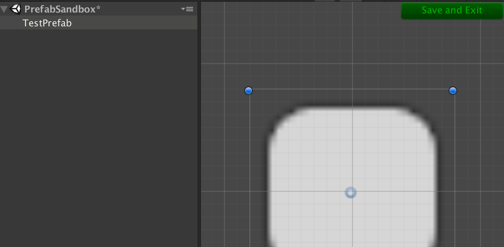

# DTPrefabSandbox
Edit and validate Prefabs quickly - in a sandbox!

### To install:
Clone the git repository and add the entire folder to your Unity project.

### Supported Versions:
Tested on Unity 5.4. It will probably work on other similar versions..

### Features:
#### Sandbox
Instead of dragging prefabs out into the scene to edit them, open them in a prefab sandbox!

DTPrefabSandbox will instantiate the prefab into a sandbox scene. You can customize the sandbox scene by creating a prefab named PrefabSandboxSetupPrefab in the project.

#### Validation
DTPrefabSandbox will also run a GameObject validator to find missing outlets (serialized fields that must be filled in with UnityEngine.Component). By default all outlets are required (and will fail validation if missing), but you can make an outlet as optional with the Optional attribute!

```csharp
public class ExampleMonoBehaviour : MonoBehaviour {
  [SerializeField] private Image _image;

  [SerializeField, Optional] private Image _optionalImage;
}
```

### How To Use:
1. Open [DTCommandPalette](https://github.com/DarrenTsung/DTCommandPalette) with `%t (Cmd-T on Mac / Ctrl-T on Windows)`
* Search for your Prefab and press enter

or

1. Search through the project window for your prefab
* Double-click on the prefab


Edit the prefab, then press "Save and Exit"!


